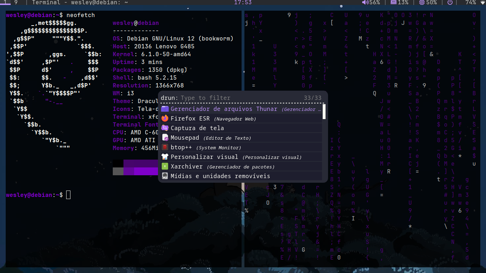

# My i3wm Rice

My Linux rice, focused on a simple, lightweight, and keyboard-driven experience.

This project contains my configuration files (dotfiles), wallpapers, and an installation script to set everything up automatically.

# Components

* i3wm — Window Manager
* Polybar — Status Bar
* Rofi — Application Launcher
* Kitty — Terminal
* Picom — Compositor
* feh — Wallpaper Manager
* JetBrainsMono Nerd Font — Font with icons
* Superfile — File Manager
* Dunst - Notifications

# Preview

# Structure

my-i3-rice/
├── configs/
│   ├── i3/
│   │   ├── config
│   │   └── powermenu.sh
│   ├── polybar/
│   ├── rofi/
│   ├── dunst/
│   │   └── dunstrc
│   ├── kitty/
│   └── superfile/
├── wallpapers/
├── install.sh
└── README.md

# Installation

Clone the repository:

git clone https://github.com/wesleyxfce/my-i3-rice.git

Enter the directory:

cd my-i3-rice

Give the installer execution permission:

chmod +x install.sh

Run the installer:

./install.sh

# What does the installer do?

The install.sh script automatically:

* Installs the required dependencies
* Installs JetBrainsMono Nerd Font
* Installs Superfile
* Copies the dotfiles to ~/.config
* Copies the wallpapers to ~/Pictures/Wallpapers
* Prepares the environment to use the rice

The configurations are installed as follows:

configs/i3/        → ~/.config/i3/
configs/polybar/   → ~/.config/polybar/
configs/rofi/      → ~/.config/rofi/
configs/kitty/     → ~/.config/kitty/
configs/superfile/ → ~/.config/superfile/
configs/dunst/ → ~/.config/dunst/

Wallpapers:

wallpapers/ → ~/Pictures/Wallpapers/

It is recommended to back up your existing configuration files before installing this rice, especially if you already have customized configurations for i3, Polybar, Rofi, or Kitty.

# Theme

This rice uses the Dracula color palette as its visual inspiration.

Credits for the theme belong to their respective authors.

# Wallpapers

The wallpapers used by this rice are stored in:

wallpapers/

You can replace or add your own wallpapers.

# Notes

This project was created primarily for my personal use.

Feel free to explore, modify, and adapt the configurations to your liking.

⸻

Made by Wesley
